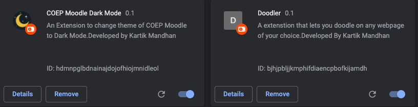
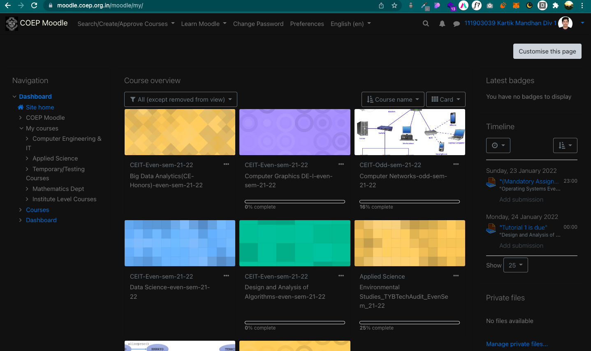
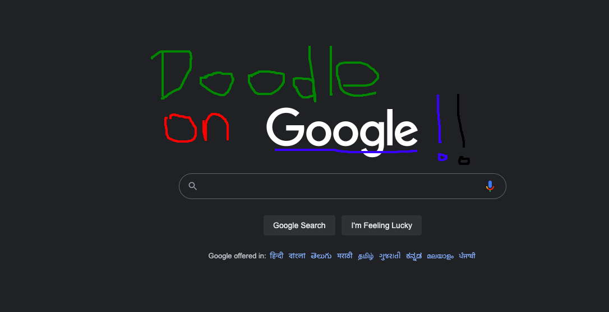

# CSI Developer Tools & Browser Extension Workshop
### This Repository Contains 2 Google Chrome Extensions -
1. COEP Moodle Dark Mode Extension
2. Doodle on any website Extension

### Installation:
1. Clone this repository
2. Open the Extension Management page by navigating to `chrome://extensions`
3.  Enable Developer Mode by clicking the toggle switch next to  **Developer mode**.
4.  Click the  **Load unpacked**  button and select the extension directory.
5. Ta-da! The extension has been successfully installed.

### Screenshots:

 

 
